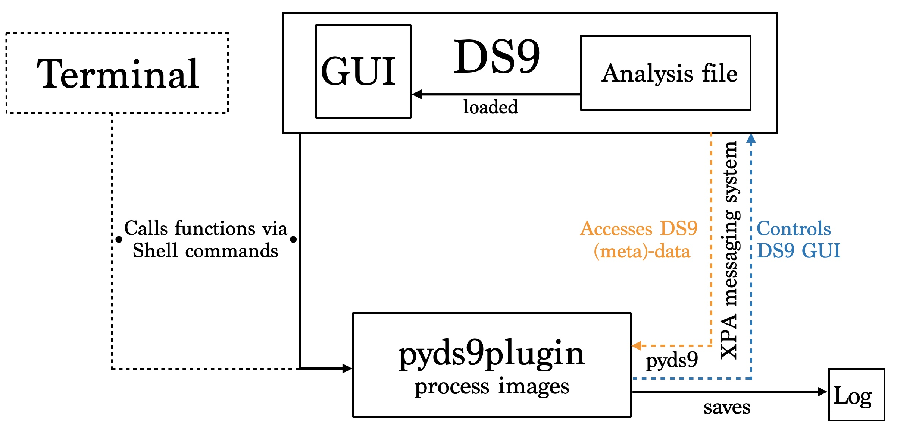
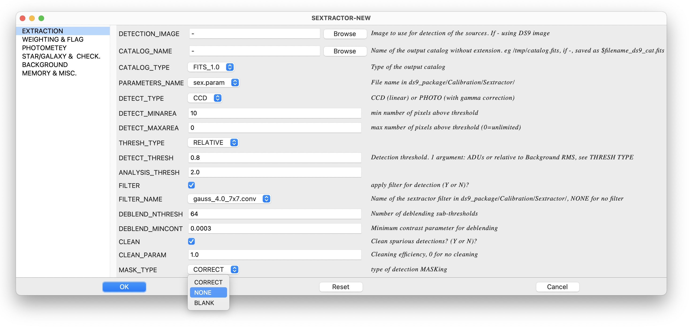
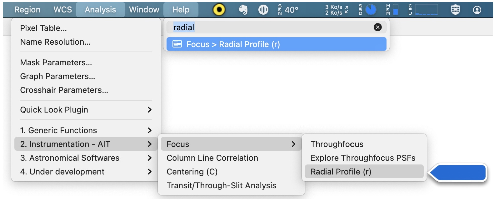

Concept and implementation
==========================

A Pythonic package
------------------

For all the reasons cited above, we decided to create the first Pythonic
`DS9` plugin: `pyds9plugin`. It is a public domain `DS9` extension for
quick-look image processing. It aims to extract quantifiable information
from imaging datasets with improved interaction. The plugin processing
functions can then be generalized automatically to a set of images to
turn the quick-look tool into a multiprocessing pipeline.

It enables new users, from undergraduate students to full-time
researchers, to actively interact (process, model, plot, etc.) with
astronomical image data with one integrated software package. This
package, available both on Pypi and
[GitHub](https://github.com/vpicouet/pyds9plugin), has been extensively
used within the FIREBall project and for CLAUDS catalogs generation.
Before going any further, I highly recommend watching this [youtube
video](https://www.youtube.com/watch?v=XcDm2JQDMLY) for a better
understanding of the package. The other videos that are linked in the
document to present some functionality are all gathered
[here](https://people.lam.fr/picouet.vincent/pyds9plugin/examples/features.html).

The way it works  
----------------

`DS9` incorporates the possibility to load extensions via an *analysis
file*. When the plugin is installed and the *analysis file* loaded into
the `DS9` analysis menu, the extension can be used. The *analysis
file* is the interface linking `DS9` GUI with the plugin's functions.
This file determines what menu is created within `DS9`, what parameters windows each
function launches, and what `Shell` command is interpreted. An example
parameter window is shown in next Figure.

Each `pyds9plugin` function is stored under `DS9Utils` access point, which links to
`pyds9plugin.DS9Utils` module. Then command lines begin by `DS9Utils`
followed by the function to be called and its arguments. `pyds9plugin`
will then communicate, control, and exchange data with `DS9` GUI via
`pyds9` package. The way the extension operates is illustrated in next.

### Communication

Within the `DS9` program, the `XPA` (X Public Access) messaging system
has been designed to provide seamless communication between `DS9` GUI
and other Unix programs (Perl, Tcl/Tk). It also provides an easy way for
users to communicate with `DS9` by executing `XPA` client `shell`
commands. The `pyds9` module uses a Python interface for `XPA` to
communicate with `DS9`. It supports communication with all of `DS9`'s
`XPA` access points in two ways. It enables read and write access to all
`DS9` parameters, which allows controlling the display (load images,
display `NumPy` arrays and catalogs, change parameters, create regions /
`DS9` plots, etc.). One interest in using Python is to use the full
capability of its famous packages such as `matplotlib`, which offers
other possibilities than the `DS9` native plotting GUI.

### Running a function

All the functions are directly accessible from `DS9` GUI (within the
analysis menu). Accessing a function will make appear a parameter window
that will then call the plugin.

Navigating through the list of `DS9Utils` functions can be quite
cumbersome for newcomers. `OSX` built-in Command Finder / Launcher
provides an expeditive alternative that allows retrieving commands
extremely fast.

Some fundamental functions are available through shortcuts to gain time.
The shortcuts are noted between parenthesis next to the function's name. The functions having a shortcut are: Open (o), lock (l), radial profile (r).

Logging and verbosity
---------------------

The functions are silent when launched from `DS9` and will only return
nominal outputs (images, regions, messages). If the code encounters an
error, the error message will pop up. If you run the same command from
the terminal, you will have, in addition, all the verbosity from
`pyds9plugin`. On top of that, all the logging is saved in
$\sim$`/DS9QuickLookPlugIn/pyds9plugin_activity.log ` whether the
function is launched from the terminal or `DS9` user interface.
