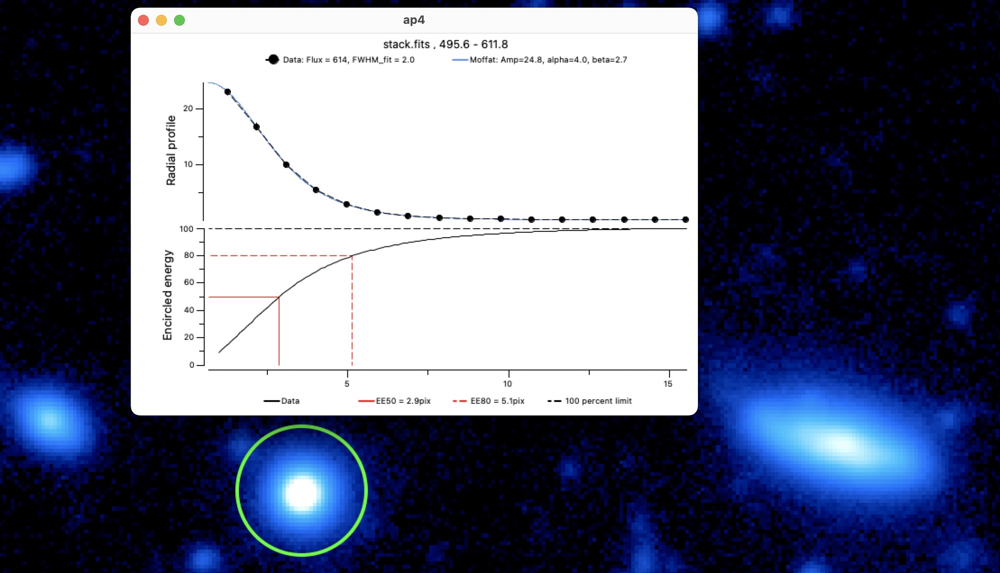
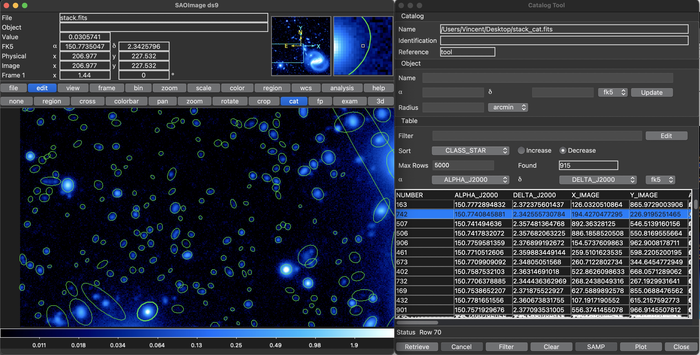

Functionality
=============

Important features
------------------

### Command line access

As expressed above, `DS9` will execute a `Shell` command, which will
call the package's functions. `DS9` allows prompting this command each
time a function is launched through:
` Analysis -> Analysis command log`. Copy-pasting this command into a
`Shell` interpreter (like Terminal) will provide the same result. The
package is then totally accessible via a `Shell` interpreter via command
lines.

This important feature could allow the plugin to be operated from other
image visualization software like Ginga or Glueviz. Running ` DS9Utils`
inside the terminal will show all the available functions and running
`DS9Utils <function> -h` will display the help
(Figure [\[ds9/DS9Utils.jpg\]](#ds9/DS9Utils.jpg)
) of the related function. This leads to
the next major feature: multi-image analysis.

All functions arguments are parsed through the `argparse` module.
Functions can then be called from `DS9`, terminal or directly from
Python using argv parameter:
$$\verb! Python_command(argv="-p '/data/**/*.fits' -e 'ds9-=1'")!  \label{eq:Python}$$


### Multi-image and multi-threaded analysis  

`pyds9plugin` is, in essence, a quick-look plugin that is perfect for
visualizing, exploring, analyzing, and processing the displayed image.
However, it was essential to make it suitable for more important
pipelines as soon as the parameters have been tuned. To this end, all
processing functions can be launched on a set of images by specifying
the path of all the images using regular expression:

`DS9Utils <function> [-o OPTIONAL] --path "/data/**/*.fits"`

This feature allows, for instance, to spend important time optimizing
interactively the $\sim50$ parameters of source extraction and add a
whole image folder to the analysis command to process all the images
when the parameters have been fine-tuned.

To take advantage of modern computer architectures, it uses
multi-threading to run each image on a different thread. The number of
processors to be used is accessible via ` -N` or `--number_processors`
argument. By default, the code will use the total number of processors
of the machine minus 2. A video can be found .

### Python interpreter  

We added a Python interpreter to the extension. This allows directly
applying Pythonic one-line transformations to the displayed image.

We list below some of the numerous one-line possibilities that can, for
instance, be used for generating some noise images, apply linear
transformation to images to decrease artificially your exposure time for instance), add noise to your image, mask bright sources, or perform more complex transformations like
fast Fourier transform or auto-correlation.

` DS9 = np.median(ds9) + 0.1 (ds9-np.median(ds9)) `

`ds9+=np.random.normal(0,0.5*ds9.std(),size=ds9.shape)`

` ds9+=np.random.normal(0,0.5*ds9.std(),size=ds9.shape) `

`ds9[ds9>np.percentile(ds9,99)]=np.nan `

`ds9=abs(fftshift(fft2(ds9)))**2 `

`ds9=correlate2d(ds9,ds9,boundary='symm', mode='same')`

### Python macros  

Because one line is short, it is possible to simply give the path of a
Python file. For instance, giving the path of the code below
interpolates masked values in the `DS9` frame and returns the new image
in the `DS9` GUI:

\
Basically, any function that does not require user's parameters can be
directly implemented this way which is simpler as multiprocessing is
already implemented. As well as for the previous section, the defined
function can be run on a set of images by adding the regular expression
path to the ` --path` parameter (see
Section [3.1.2](#Multi-image and multi-threaded analysis)
 and ):

` DS9Utils python_command --exp "/softs/pipe.py" -p "/data/**/*.fits"`

The different variables that can be used inside *macros* are *ds9* for
the image loaded in `DS9` and *header* for its header and *d* is the
`XPA` access point for a more extensive communication with `DS9`.

Following lessons learned from @Joye2005, I decided to include in
`DS9` analysis functions only the ones that are generic/helpful and that
require input parameters. Functions that do not require any parameter
should be implemented as macros as multiprocessing is already
implemented. To help people write their own, I published within the
plugin several macros (in ` DS9functions/macros`). Each macro (`FFT.py`,
`Autocorrelation.py`, `trimming.py`, `Column_line_correlation.py`,
`Interpolate_NaNs.py`, etc.) can either contain one specific task
(compute and return the FFT of the `DS9` image, trim wcs images,
interpolate masked values in the image, etc.) or a series of processing
(background subtraction source extraction astrometric calibration)

### VTK 3D rendering  

The Visualization Toolkit (`VTK`) is the leading open-source software
for manipulating and displaying scientific data. It comes with
state-of-the-art tools for 3D rendering, a suite of widgets for 3D
interaction, and is already supported by some of the other applications
(`JS9`, `Icy`, `AstroImageJ`). We integrated it into the plugin to
increase the interaction with selected regions in the image. The
function allows to add contours, smooth the image rendering, change the
scale, or create a rotating `.gif` video. Possibility to even fit
interactively 2D Gaussians. It is also possible to analyze time series
in 3D like through-focus or to explore the focus in the field.


### Interactive profile fitting  

`DS9` incorporates the very useful possibility to interactively plot 1D
profiles (can be tilted, stacked in the orthogonal direction, plot the
third axis component, etc). This gives essential qualitative
information.

Because it is essential to retrieve information from images
(spatial/spectral resolution, diffusion exponential decay, etc.) it is
critical to turn this qualitative information into re-usable
quantitative information. To do this we added an interactive plot fitter
to the extension (based on the
[`dataphile`](https://GitHub.com/glentner/dataphile) package). This
allows fitting 1-D profiles with interactive adjustment of the initial
guess parameters to ensure that the fit converges. This function works
on any `DS9` plot, which means that plots generated via the plugin
(radial profile or light curve) can be fitted with this function.

As multi-feature analysis is essential in astronomy, the fitting is
decomposed into two components: the background and the features added to
the background. The different background possibles are constant, slope,
exponential, double-exponential, logarithmic. It is then possible to add
any number of features among Gaussian, Voigt, or Moffat profiles (see
Figure [\[ds9/fit2d.jpg\]](#ds9/fit2d.jpg)
). Each feature parameter can be moved
independently to be sure that the final fit converges. The definition of
the different functions is shown in
table [1](#functions). To
get the most of this fitting function, we added the possibility to add
any other user-defined functions.

The function just needs to be added to the package file:\
`pyds9plugin/Macros/Fitting_Functions/functions.py`

For each fitted parameter, be sure to define a list as default argument
as it will be used to define the lower and upper bounds of the widget
fitter.


<!-- :::  
  Function             Formula
  -------------------- --------------------------------------------------------------------------------------------------------------------------------------------------------------------------------------------------
  Constant             $y = a$
  Slope                $y=a \cross x$
  Exponential          $y=a\cross e^{-\frac{x}{b}}$
  Logarithmic          $y=a + b\cross ln(x-c)$
  Double exponential   $y=a\cross e^{-\frac{x}{b}} + c\cross e^{-\frac{x}{d}}$
  Gaussian             $y=a \cross e^{-(\frac{c-b}{2*c})^2}$
  Moffat               $y=a\cross (1 + \frac{x-b}{c}^{2})^{-d}$
  Voight               $y=a \cross\frac{  \mathbb{R}\left ( wofz \left (  \frac{(x-b) \gamma i}{c\sqrt{\pi}} \right ) \right )  }{  \mathbb{R}\left ( wofz \left (  \frac{x \gamma i}{c\sqrt{\pi}} \right ) \right ) }$ -->
<!--
  : Fitting functions of the profile fitter. The first four functions
  are the possible backgrounds to fit. On top of this background, you
  can add as many Gaussian/Moffat/Voigt features as you want. The wofz
  function in the last line is the Faddeeva function
  $wofz(z)=e^{-z^2} \cross (1-erf(-iz) )$ accessible in Python via
  scipy.special.wofz
::: -->

If no plot neither catalog is given, the window will work as a regular
plotter, where the user can plot its own function and change the
parameters.

### Fits file organizer  

This final functionality is a fits organizer, divided into two functions
(Create header database and Filtering and organizing images). The first
function generates from the input images (regular expression) a catalog
(CSV table) concatenating all information contained in the header
images. It will also add important information such as the path,
directory, basename, creation and modification date, size, etc. of each
image.

The output database will give at a glance all image information which
will help understand the dataset, spot failures in the acquisition, etc.
It can also be open with `TOPCAT` to perform more complex analysis and
selection of images (See figure
 [\[ds9/files.jpg\]](#ds9/files.jpg)
 )

As only header information is read (not the pixels), the function is
fast even on a significant number of files (a few seconds for thousands
of files). Still, it can be very interesting to add to the output header
catalog some image information such as the images' median, noise, the
number of saturated pixels, or any other information. To this end, the
function accepts `Header catalog Macros` where the user can write any
Python command to append image estimators to the output header catalog.
For instance, the following piece of code add to the header database
some information about the image (column/line correlation, saturated
pixels fraction, number of cosmic rays, etc.):

```python
from astropy.convolution import interpolate_replace_nans, Gaussian2DKernel

STD_DEV = 1
while ~np.isfinite(ds9).all():
  kernel = Gaussian2DKernel(x_stddev=STD_DEV, y_stddev=STD_DEV)
  \texttt{DS9} = interpolate_replace_nans(ds9, kernel)
  STD_DEV += 1
```


The output header database can be used with the second function, which
filters the images and organizes them following organizational rules.
This function allows creating subsets of images verifying some header
conditions. For instance, all images created after the 12th of September
2020 that have a positive EMGAIN or an exposure higher than 100 seconds
can be recovered with this condition: $$\renewcommand{\theequation}{6}
\verb! (EMGAIN > 0 | EXPOSURE >100) & CreationTime>200912 !  \label{eq:selection}$$

The files are then directly organized in the file system with an
arborescence following the column names. For instance, by giving
`EMGAIN,EXPOSURE`, all files will get organized as shown in
figure [\[ds9/filter_files.jpg\]](#ds9/filter_files.jpg)
. A video can be found . The function
only generates aliases and does not move any original files. The header
database and organized aliases are respectively saved in
$\sim$`/DS9QuickLookPlugIn/HeaderDataBase ` and
$\sim$`/DS9QuickLookPlugIn/subsets `.


The different functions  
-----------------------

The functions are divided into three categories to help the organization
(see
Figure [\[ds9/commands.jpg\]](#ds9/commands.jpg)
):\
Generic functions, instrumentation-related functions, and
astronomical-software-related functions. To make more accessible the
understanding of each function, they are possibly prefixed by three
badges:\
**Boosting interaction:** These functions are considered to improve the
interactivity between the user and the visualized data. This interaction
can be based on user-defined regions, interactive fitting, generation of
pickable metadata, etc.

**DS9 not required:** The function is totally accessible via Terminal
independently from `DS9`, which means that the function does not need
`DS9` to be installed/open for being called. This can be interesting for
server users.

**Multi-image processing:** The function, accessible via `Shell`
command, can be run on several images, and each analysis will run on a
different thread (See
section [3.1.2](#Multi-image and multi-threaded analysis))


### Generic functions  

This series of very general functions aims at filling some gaps of `DS9`
with stable generic functions (fitting, region-based functions), gaining
some time with key functions: (change display settings/lock parameters),
etc.

-   **Change Display Parameters** This basic function applies specific
    thresholding, scale, and colormap to the `DS9`-loaded image to give
    a quick and general visualization of the image. Accessible via one
    key hit (S), this allows exploring the full depth of the image
    quickly. More interestingly, the user can focus on a specific region
    of the image by creating and selecting a box or a circle on the
    region of interest ().

-   **Lock / Unlock Frames** Access all the locking parameters of `DS9`
    frames at once to gain time: frame, crosshair, smooth, scale-limits,
    colorbar.

-   **Create Header DataBase** Creates a catalog combining all meta-data
    information.

-   **Filtering & organizing images** Uses fits file database to create
    and order nicely filtered fits files
    (Section [3.1.7](#Fits file organizer))

-   **Macro / Python Command** Interprets a Python command or file and
    applies it to given image(s)
    (Sections [3.1.3](#Python interpreter)

    and [3.1.4](#Python macros)
    )

-   **Interactive 1D Fitting On Plot** Fit interactively any `DS9` plot
    or catalog by different pre-defined functions
    (Section [3.1.6](#Interactive profile fitting)
    )

-   **Fit Gaussian 2D** Performs 2D Gaussian fitting on the encircled
    region in DS9. Opens up a VTK 3D plot of the encircled data. Any
    other feature can be fitted by selecting it (r). Each fit creates a
    region on the `DS9` GUI with the fit parameters of
    `astropy.modeling.functional_models.Gaussian2D` ().

-   **Trimming** Cropping/Trimming function that keeps WCS header
    information.

-   **Open file(s)** in `DS9` in an easier way. Possibility to enter the
    path of an image and a regular expression to open multiple files.
    Files can be open in the following format: Slice,
    Multi-frame-as-cube, multi-frame, RGB, Cube, PRISM.

-   **Plot Region In 3D** See
    Section [3.1.5](#VTK 3D rendering)
    , and
    Figures [1](#ds9/3d.jpg)

    and [\[ds9/3d3d.jpg\]](#ds9/3d3d.jpg)


-   **Convert image** Convert file into another type. The different
    types are (int8, int16, int32, int64, float32, float64) with the
    possibiity to rescale pixels value.

    <!--  -->
    

### Instrumentation  

This series of functions aims to assist instrument researchers during
assembly and testing with through-focus, light curves, centering,
radial, energy profile analysis, etc. More complex but general
processing functions (for detector characterization, for instance) can
be found in the macros (See
section [3.1.4](#Python macros)
) like auto-correlation, fast Fourier
transform, smoothing, masking, interpolation, noise measurements, etc.

-   **Centering (C)** Centers `DS9` region encircling a spot. Five
    centroid methods are available: maximum, $2\times1$1D fittin, 2D
    fitting, barycenter).

-   **Radial profile** Compute and plot azimuthally averaged radial
    profile and energy profile of the encircled source in `DS9` after
    performing a re-centering. For extended sources, the source size can
    be informed to deconvolve the radial profile from the source
    (Figure [\[ds9/radial.jpg\]](#ds9/radial.jpg)
    ).

-   **Throughfocus analysis** Perform a through-focus analysis on a
    series of images and return different focus estimates as well as the
    3D evolution of the PSF
    (Figure [\[ds9/throughfocus.jpg\]](#ds9/throughfocus.jpg)
    ).

-   **Explore PSFs/vignettes** Explore PSFs/vignettes based on
    `SExtractor` catalog to visualize how it evolves in the field or
    with FWHM, magnitude, excentricity, angle or amplitude.

-   **Light curve** Perform a light-curve analysis and returns the
    centered image.

-   **Extract Sources** Extract sources from images(s) using photutils
    [@Bradley2016]

-   **Subtract Background** Subtract background from images(s) using
    photutils

-   **Aperture photometry** Computes photometry in given aperture(s)





### Astronomical software  

The goal of this series of functions is to link the most essential
astronomical image processing software like the astromatic suite
(`SExtractor`, `Stiff`, `Swarp`, `PSFex` - need to be installed) and
offer them a parameter GUI.

-   **Astrometric Calibration** Uses `astrometry.net` to compute
    position on the sky and return WCS header. If regions are created
    (by hand or via `SExtractor`) and the parameter XY-catalog is set,
    only the position of the sources will be uploaded ().

-   **`STIFF` - Color Images** Run `STIFF` astromatic software
    [@Bertin2011a] to convert scientific FITS images to the more popular
    TIFF format for illustration purposes ().

-   **`PSFex`** Run `PSFex` astromatic software [@Bertin2011] to
    extracts models of the Point Spread Function from FITS images
    processed with `SExtractor`, and measures the quality of images. The
    generated PSF models can be used for model-fitting photometry or
    morphological analyses.

-   **`SExtractor`** Run `SExtraxtor` astromatic software [@Bertinl1996]
    to build a catalogue of objects from an astronomical image
    (Figure [\[ds9/sex.jpg\]](#ds9/sex.jpg)
    ).

-   **`Swarp`** Run `Swarp` software from `DS9` [@Bertin2010] to
    resample and co-add together FITS images using any astrometric
    projection defined in the WCS standard.

-   **Resample images** Run part of `Swarp` astromatic software for
    resampling without co-addition.

    
