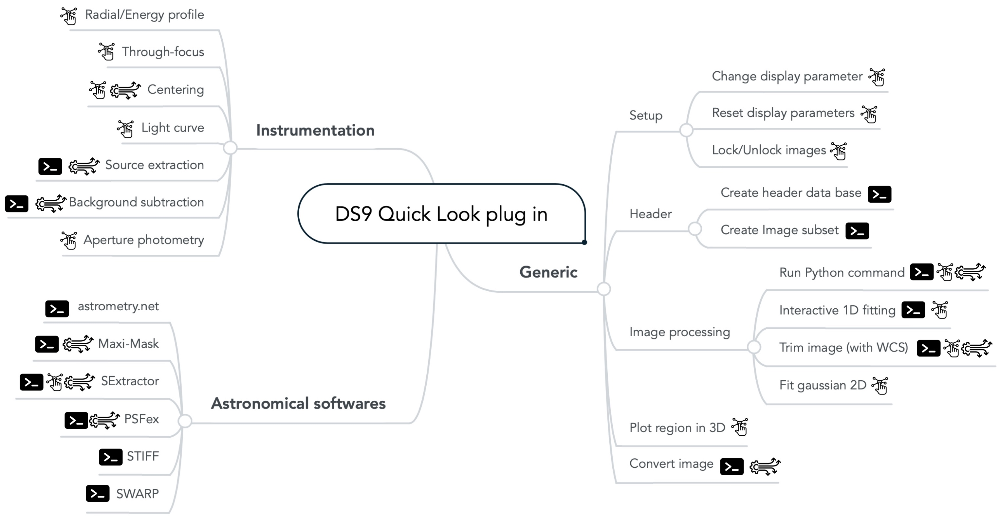
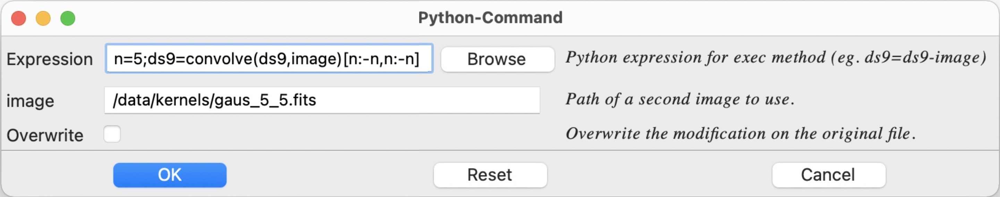
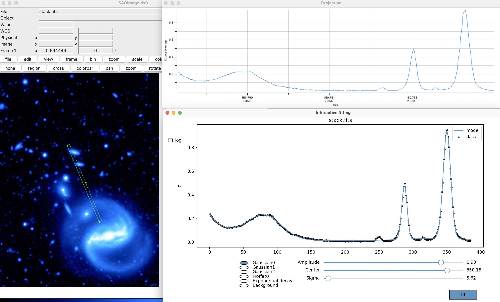
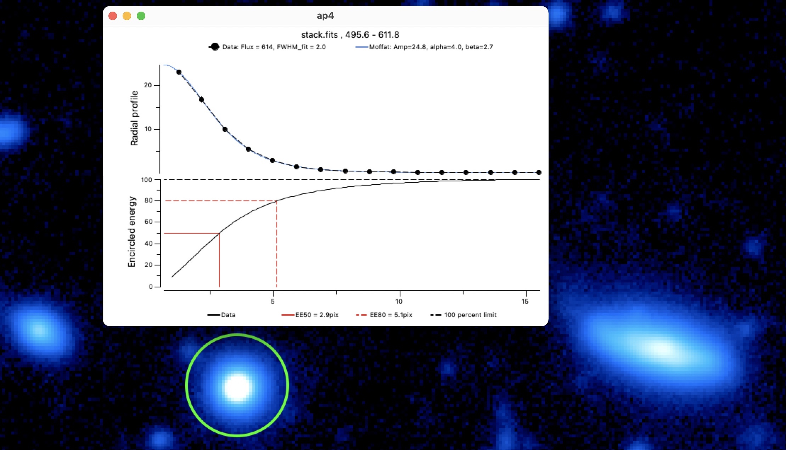
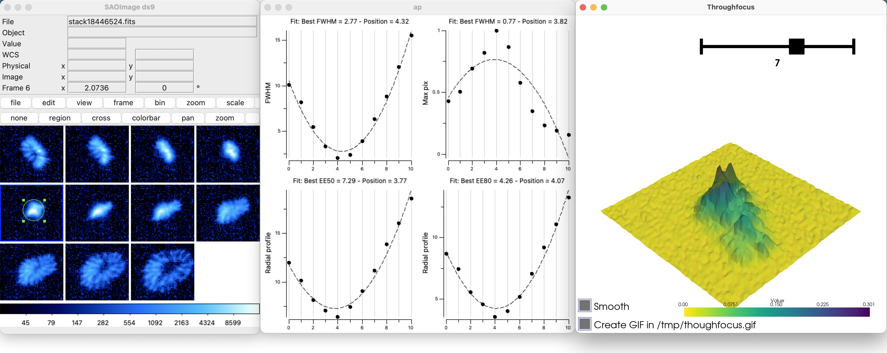
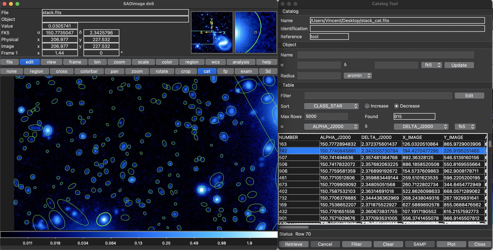

The different functions  
-----------------------

The functions are divided into three categories to help the organization:
Generic functions, instrumentation-related functions, and
astronomical-software-related functions. To make more accessible the
understanding of each function, they are possibly prefixed by three
badges:

- **Boosting interaction:** These functions are considered to improve the
interactivity between the user and the visualized data. This interaction
can be based on user-defined regions, interactive fitting, generation of
pickable metadata, etc.

- **DS9 not required:** The function is totally accessible via Terminal
independently from `DS9`, which means that the function does not need
`DS9` to be installed/open for being called. This can be interesting for
server users.

- **Multi-image processing:** The function, accessible via `Shell`
command, can be run on several images, and each analysis will run on a
different thread

*pyds9plugin's functions divided in the three sub-extensions: generic functions, instrumentation and astronomical software. The terminal icon emphasize functions that do not require DS9 to be launched, which can be interesting for generalizing the processing on a server.
Most of these functions (highlighted with the wheel icon) are compatible with multi-image and multi-threaded analysis.
Functions with enhanced interactivity based on pickable meta-data for instance are marked with the  interactivity icon.*

### Generic functions  

This series of very general functions aims at filling some gaps of `DS9`
with stable generic functions (fitting, region-based functions), gaining
some time with key functions: (change display settings/lock parameters),
etc.

-   **Change Display Parameters** This basic function applies specific
    thresholding, scale, and colormap to the `DS9`-loaded image to give
    a quick and general visualization of the image. Accessible via one
    key hit (S), this allows exploring the full depth of the image
    quickly. More interestingly, the user can focus on a specific region
    of the image by creating and selecting a box or a circle on the
    region of interest.

-   **Lock / Unlock Frames** Access all the locking parameters of `DS9`
    frames at once to gain time: frame, crosshair, smooth, scale-limits,
    colorbar.

-   **Create Header DataBase** Creates a catalog combining all meta-data
    information.

-   **Filtering & organizing images** Uses fits file database to create
    and order nicely filtered fits files

-   **Macro / Python Command** Interprets a Python command or file and
    applies it to given image(s)

-   **Interactive 1D Fitting On Plot** Fit interactively any `DS9` plot
    or catalog by different pre-defined functions

-   **Fit Gaussian 2D** Performs 2D Gaussian fitting on the encircled
    region in DS9. Opens up a VTK 3D plot of the encircled data. Any
    other feature can be fitted by selecting it (r). Each fit creates a
    region on the `DS9` GUI with the fit parameters of
    `astropy.modeling.functional_models.Gaussian2D`.

-   **Trimming** Cropping/Trimming function that keeps WCS header
    information.

-   **Open file(s)** in `DS9` in an easier way. Possibility to enter the
    path of an image and a regular expression to open multiple files.
    Files can be open in the following format: Slice,
    Multi-frame-as-cube, multi-frame, RGB, Cube, PRISM.

-   **Plot Region In 3D**

-   **Convert image** Convert file into another type. The different
    types are (int8, int16, int32, int64, float32, float64) with the
    possibiity to rescale pixels value.

    <!--  -->
    

### Instrumentation  

This series of functions aims to assist instrument researchers during
assembly and testing with through-focus, light curves, centering,
radial, energy profile analysis, etc. More complex but general
processing functions (for detector characterization, for instance) can
be found in the macros like auto-correlation, fast Fourier
transform, smoothing, masking, interpolation, noise measurements, etc.

-   **Centering (C)** Centers `DS9` region encircling a spot. Five
    centroid methods are available: maximum, $2\times1$1D fittin, 2D
    fitting, barycenter).

-   **Radial profile** Compute and plot azimuthally averaged radial
    profile and energy profile of the encircled source in `DS9` after
    performing a re-centering. For extended sources, the source size can
    be informed to deconvolve the radial profile from the source.

-   **Throughfocus analysis** Perform a through-focus analysis on a
    series of images and return different focus estimates as well as the
    3D evolution of the PSF.

-   **Explore PSFs/vignettes** Explore PSFs/vignettes based on
    `SExtractor` catalog to visualize how it evolves in the field or
    with FWHM, magnitude, excentricity, angle or amplitude.

-   **Light curve** Perform a light-curve analysis and returns the
    centered image.

-   **Extract Sources** Extract sources from images(s) using photutils

-   **Subtract Background** Subtract background from images(s) using
    photutils

-   **Aperture photometry** Computes photometry in given aperture(s)

*Radial and energy profile estimation. The function also returns different image quality estimators: FWHM, $50\%$ and $80\%$ encircled energy, Moffat fit.*

*hrough-focus analysis based on a set of calibration images. The function generates a plot with four focus estimates: FWHM, EE$_{50\%}$, EE$_{80\%}$, Max$_{\mathrm{pix}}$*

### Astronomical software  

The goal of this series of functions is to link the most essential
astronomical image processing software like the astromatic suite
(`SExtractor`, `Stiff`, `Swarp`, `PSFex` - need to be installed) and
offer them a parameter GUI.

-   **Astrometric Calibration** Uses `astrometry.net` to compute
    position on the sky and return WCS header. If regions are created
    (by hand or via `SExtractor`) and the parameter XY-catalog is set,
    only the position of the sources will be uploaded.

-   **`STIFF` - Color Images** Run `STIFF` astromatic software
    to convert scientific FITS images to the more popular
    TIFF format for illustration purposes.

-   **`PSFex`** Run `PSFex` astromatic software to extracts models of the Point Spread Function from FITS images processed with `SExtractor`, and measures the quality of images. The generated PSF models can be used for model-fitting photometry or morphological analyses.

-   **`SExtractor`** Run `SExtraxtor` astromatic software
    to build a catalogue of objects from an astronomical image.

-   **`Swarp`** Run `Swarp` software from `DS9` to
    resample and co-add together FITS images using any astrometric
    projection defined in the WCS standard.

-   **Resample images** Run part of `Swarp` astromatic software for
    resampling without co-addition.

    
    *`SExtractor` function output. Here, all the regions can be selected and will show a particular raw of the catalog. Likewise, one or several lines of the catalogs can be selected, and the corresponding region(s) will blink. This can be of huge interest to optimize source extraction settings, to find particular objects in the image, etc.*
