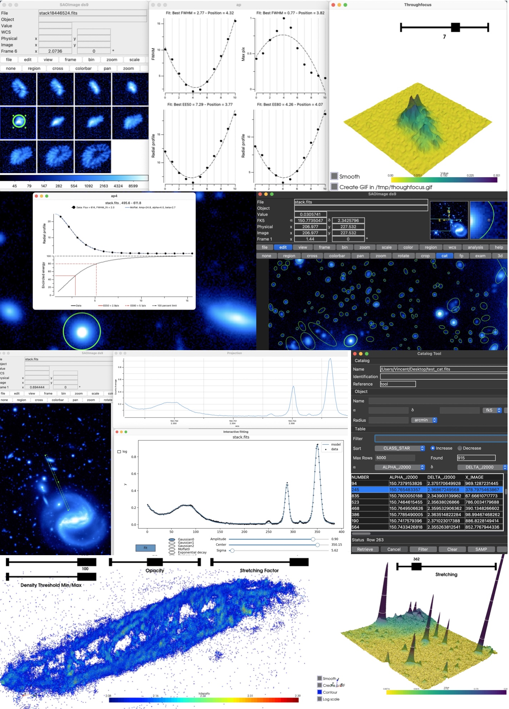

<!-- # Welcome to MkDocs

For full documentation visit [mkdocs.org](https://www.mkdocs.org).

## Commands

* `mkdocs new [dir-name]` - Create a new project.
* `mkdocs serve` - Start the live-reloading docs server.
* `mkdocs build` - Build the documentation site.
* `mkdocs -h` - Print help message and exit.

## Project layout

    mkdocs.yml    # The configuration file.
    docs/
        index.md  # The documentation homepage.
        ...       # Other markdown pages, images and other files. -->


<!-- # [DS9 Quick look Plug-in](https://people.lam.fr/picouet.vincent/index.html) -->

<!-- $$
\operatorname{ker} f=\{g\in G:f(g)=e_{H}\}{\mbox{.}}
$$ -->


<iframe width="560" height="315" src="https://www.youtube.com/embed/XcDm2JQDMLY" title="YouTube video player" frameborder="0" allow="accelerometer; autoplay; clipboard-write; encrypted-media; gyroscope; picture-in-picture" allowfullscreen></iframe>
<iframe width="560" height="315" src="https://www.youtube.com/embed/_4WP38UFuco" title="YouTube video player" frameborder="0" allow="accelerometer; autoplay; clipboard-write; encrypted-media; gyroscope; picture-in-picture" allowfullscreen></iframe>

<!-- [](https://www.youtube.com/watch?v=XcDm2JQDMLY) -->


<!-- SAOImage DS9 is an astronomical imaging and data visualization application. Its 30 years of development has made it very stable and easy to use. This made it an essential tool in all fields of astronomy (observation, simulation, instrumentation). Much more profitable but pretty unsung feature, its extensibility makes it a limitless tool to interact with astronomical data. This extensibility did not generate a large collaborative and well organized effort to develop important extensions that could progressively converge towards a stable/rapid/configurable multi-extension DS9 package.

Because I am convince of its interest, this extension is a very naive attempt to try initiate this tendency and explore the different possibilities. -->
pyDS9plugin is the first open source pythonic [SAOImageDS9](https://sites.google.com/cfa.harvard.edu/saoimageds9) quick look plugin. It can be found on [GitHub](https://github.com/vpicouet/pyds9plugin). Its goal is three-fold:

- Pushing the DS9 visualization application a step further by combining it to image processing tools
- Boosting the way we interact with scientific images in a quantitative way
- Catalyze community collaboration and code enhancement by providing a first extensive package gathering a glimpse of all the possibilities that offers DS9 extensibility


Table of content
----------------
### User Guide

- [Installation](install.md)
- [Tutorials](user.md)
- [Important features](feature.md)
- [All the functions](function.md)

### About

- [Development philosophy](philosophy.md)
- [Concept and implementation](concept.md)
- [License](license.md)


<!-- Animated GIF of AutoGUI -->


<!--
Installation
------------

To install pyds9plugin for general purposes use Pip:

```
pip install pyds9plugin
```

Finish the installation and see the different functions by running:

```
DS9Utils
```

Finally, load the analysis file in DS9 by running:

```
DS9Utils LoadDS9QuickLookPlugin
```
And launch DS9! -->



