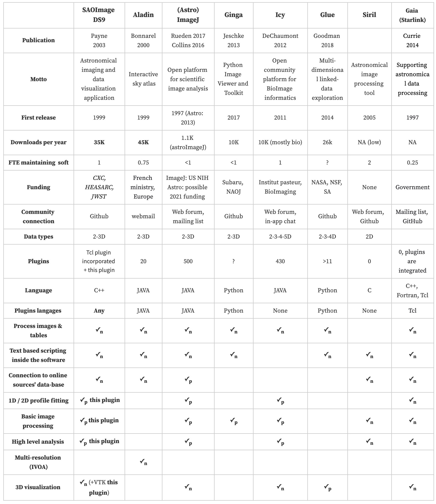

<iframe width="560" height="315" src="https://www.youtube.com/embed/_4WP38UFuco" title="YouTube video player" frameborder="0" allow="accelerometer; autoplay; clipboard-write; encrypted-media; gyroscope; picture-in-picture" allowfullscreen></iframe>

Motivation
----------

Current fits viewer applications (`SAOImage DS9`, `Aladin`, `GINGA`,
`Glue`) have been developed to optimize the visualization of
astronomical images while keeping some interesting specificities:
linked-data exploration, interactive sky atlas access, flexible and
extensible visualization toolkit, etc. Not initially designed for image
processing, these applications do not address this need as it would
break their conceptual integrity (by dispersing their purpose). This
leaves it to big instrument consortiums who will design their own data
processing pipeline, which will, most of the time, be too specific to be
re-used by the astronomy community.

For the particular discipline of astronomy evolving towards Jim Gray's
fourth paradigm and where an essential part of the job
relies on image analysis, the lack of processing codes draws a new
challenge for current and future imaging software: mimicking what has
been done for bioimage analysis by addressing the current frontier of
image processing.

Among the different difficulties that need to be addressed to make the
processing software beneficial (catalyzing community collaboration and
code enhancement, multi-image analysis, extensibility), one key aspect
is to keep the essential high-level interactivity between the data and
the user, which became a consensual feature for visualization.

For various reasons that I will present, the
development of *plugins* for fits viewer applications represents an
exciting way to take up the challenge of developing image processing
tools and address the related difficulties.

I will then use introduce `pyds9plugin`: an attempt to design such a plugin. This `DS9` quick look plugin is a public domain versatile extension I designed for `DS9` visualization
software. The plugin pushes `DS9` visualization software a step further
by allowing to analyze and process in real-time images while keeping a
high level of interactivity. The processing functions can then be
generalized automatically to a set of images to turn the quick-look tool
into a multiprocessing pipeline.

This plugin incorporates essential functions (radial profile, 2D/3D
fitting, trough-focus, stacking, background removal, source/artifact
extraction, etc.) to extract quantitative and intelligible information
from imaging datasets in order to support instrumentation, reduce
observations, analyze data performance, etc. We also linked the most
famous astronomical codes (`SExtractor`, `Swarp`, etc.) to the plugin to
allow research-grade analysis and processing. As all researchers have
different needs, the plugin is designed intelligibly to allow everyone
to add their own macros that can then be run quickly and automatically
on a set of images thanks to multiprocessing. This `pyds9plugin`,
available both on Pypi and Github, tries to gather a glimpse of all the
possibilities that offers `DS9` extensibility so that it motivates
astronomers exploring this development approach. This hybrid chapter
aims at giving an overview of the achieved work.

Existing tools
--------------

### Existing tools, strengths and weaknesses

The different main existing software for image visualization/processing
are [SAOImageDS9](https://sites.google.com/cfa.harvard.edu/saoimageds9),
[Aladin](https://aladin.u-strasbg.fr/AladinDesktop/),
[Ginga](https://ginga.readthedocs.io/en/stable/) and
[GlueViz](https://glueviz.org). Some other non-astronomy-related image
processing codes have developed astronomy plugins like
[ImageJ](https://imagej.nih.gov/ij/) and
[Icy](http://icy.bioimageanalysis.org). Next Figure sum up each software approach and
different characteristics as well as their different strengths and
weaknesses in terms of image visualization and processing. On a total of
about 127,000 downloads, `Aladin`, `DS9`, `GlueViz`, and `Ginga`
represent respectively 36%, 28%, 20%, and 8% percent of the
total downloads.

*Main image visualization/processing applications in astronomy.  Native features are marked as V$_n$ while feature added via plugins are marked as  V$_p$. This table is based on a survey sent to fits viewers lead developers. In the survey, we called basic image processing radial profile, light curve, source extraction, etc. and high-level analysis: deconvolution, Fourier transform, etc.*

There seems to be some consensus on the interest of plugins to extend
the possibilities of each software as only one software does not
currently allow it. It also appears difficult for applications to
incorporate the different listed functionality as native features. Most
of the extensions need to be written in JAVA, some in Python, and `DS9`
allows to develop low-level plugins in basically any language as soon as
it supports `XPA` or `SAMP` communication.

### The need for collaborative development

`DS9` lead developers remind that more bodies do not
equal better results by citing Fred Brooks: "*the \[software\] design
must proceed from one mind, or from a very small number of agreeing
resonant minds*". Even though they believe that conceptual integrity
requires a small team of developers, they face an expanding pressure due
to the success of `DS9` and confess spending 80% of their time in
supporting users and maintaining/enhancing existing capabilities which
leaves them with only 20% of time to innovate on new functionality.
On the other side, I saw significant efforts in different teams to
develop project-related processing tools and pipelines to analyze
images, but they often are too specific to be re-used by the community
and then stay within the collaboration that produced them.

Agreeing with the fact that conceptual integrity requires a small team
which unfortunately leads to much less time to innovate when the product
gains maturity, it seems that the best compromise is the development of
plugins by the community:

-   This allows important and free innovation that will not break the software's concept/purpose

-   Best interesting features/innovations that will emerge by themselves can then be merged into the initial software (as it has already been done for `DS9`, `GAIA`)

-   This is particularly true in the open astronomy community where collaborative development becomes extremely popular

This modularity and plugin philosophy is used by the majority of the top
10 open-source software: `VLC`, `Libre Office`, `Firefox`,
`Thunderbird`, and by other fast-growing software: `Nextcloud`,
`Mattermost`, `Atom`. This trend is similar for open-source image
analysis software: `GIMP`, `ImageJ`, `GINGA`, `Icy`, `Starlink`, etc.

!!! note
    A plugin is a software component or module designed to extend the functionality of an existing software application. The application architecture determines where and how plugins can be embedded (for example, reading or writing new formats, accessing and processing image data, etc.). Open-source software, in  contrast to closed-source packages, often relies on plugins to  foster contributions and expertise from the community

Goals
-----

The goal is then to create a plugin that would fill the needs expressed above. The three different distant objectives that aim to make astronomers gain time are detailed below.

### Boosting interaction with scientific images

The fact that astronomical data gets bigger is driving the way image
software and pipelines are designed. It seems that the workforce is more
directed towards developing specific applications (either
**project-specific**: single-project-related pipelines, or **big-data
specific**: web-hosted applications, neural-network-based analysis)
rather than improving comprehensive applications working at the pixel
layer and enhancing the interaction between the user and the data so
that it can be used by a broader community. Specific applications listed
above are important but will not fill the need that each astronomical
project requires at some point a local and high-performance image
processing software to work at the pixel level with improved
interactivity.
Current local and easy-to-use applications would still greatly benefit
from enhanced interactivity and ergonomy. They represent an excellent
test-bench opportunity to implement interactive features before
spreading them to other more complex applications (such as web-based or
big-data related). The plugin we present in this study will then focus
on trying to develop interactive features.

!!! note
    We call interaction a direct communication between the user and the software which is not only via the menu bar. All basic fits-viewers incorporate as native and interactive feature zooming, panning, rotating, changing scale limits. However, it could be pushed to the next level with, for instance, interaction with metadata (like regions of interest or catalogs), interactive detection and selection of sources, interactive plotting, and profile fitting, etc. Some work is ongoing to make some tools more interactive, but it is still in its infancy.

### Turning a visualization software into an image processing software

Another aspect is that among all the fits-viewers, a minor fraction
allows some image processing (`GAIA` is the most advanced example but
does not seem to gather a vast community, `Icy` for bio-images,
AstroImageJ for light curves). Even though it is not their first
purpose, this leaves almost no software to perform basic image
processing (source extraction, background subtraction, radial profile,
light curve, focus analysis, one-line interpreters, macros, etc.).
Incorporating these features inside these fits-viewers might be
premature at this stage as it could break the software concept integrity
but spending time developing them as a plugin seems essential to make
scientists earn time in their research.

### Building a code collaboration catalyst

A byproduct of such plugins would be that people would not need to
reinvent the wheel each time they need to perform some basic image
processing like a radial profile. Such a plugin could be written to
become a code collaboration catalyst which could then fill two important
needs:

-   Help people process images with less time or coding proficiency as
    they could lean on tested and ready-to-use image processing modules
    instead of making them code existing things.

-   It could become a function aggregator for different types of
    structures (from the Ph.D. group of a given lab up to the astronomy
    community) where processing codes would be organized and maintained
    so that most of the written code within a lab stops disappearing
    each time a Ph.D. student leaves, or a senior researcher retires.

The two issues (implementing existing code and losing unreleased code)
represent a significant amount of time/knowledge/money loss. To make
this possible the package:

-   should be written in Python (because of the consensual
    implementation effort in this language in astronomy) as we aim to
    gather codes/community

-   must be intelligible so that it can be easily re-appropriated and
    modifiable so that people can add functions to the extension

-   allows running Macros directly

The plugin we present in this study is a naive attempt to try to
initiate this tendency and gather a glimpse of the main possibilities
that fits-viewers plugins can offer.

The choice of SAOImage DS9
--------------------------

[`SAOImage DS9`](https://sites.google.com/cfa.harvard.edu/saoimageds9)
is an astronomical imaging and data visualization application. It
gathers all of the other essential pieces of a modern fits viewer. Its
30 years of development has made it very stable and easy to use. Because
of this, it became an essential tool in all fields of astronomy
(observation, simulation, instrumentation). Much more profitable but
pretty unsung feature; its extensibility makes it a limitless tool to
interact with astronomical (or not) data. Unfortunately, it appears that
this extensibility did not inspire or generate a large collaborative and
well-organized effort to develop significant extensions that would
finally, years after years, converge towards a stable/rapid/configurable
DS9-affiliated package. The important strengths of `DS9` that governed
our choice are:

**Popularity:** with ~35K downloads a year, `DS9` belongs to the
top two leaders in image visualization for astronomy. It also has the
closest purpose to what we aim to develop (more image-focused than
Aladin, even though it similarly accesses catalogs). It has a large
enough community so that designing low-level plugins could work.

**Any language extensibility:** `DS9` architecture is set to accept
plugins, coded in any language by just sending a `Shell` command. This
is an essential strength in astronomy, where an unprecedented synergy
occurs around Python language.

**Stability and simplicity:** With a "*Keep it simple*" golden rule and 30 years of development, `DS9` is incredibly simple and
stable, which will help the development of our initiative. Indeed such
initiatives can have downside effects such as fragmenting the existing
community by requiring specific formating/language/etc. `DS9` allows
ultra-simple extensibility with quasi no format requirement as it simply
sends background `Shell` commands that can call any extension and
control the GUI.

`DS9` then seemed the perfect software to experiment such a plugin.

Discussion and conclusion  
-------------------------

In this chapter, I tried to stress the need for astronomical image
processing applications. I emphasize the different requirements of such
an application and explain why Python extensions for already proven
visualization software represent an exciting approach to address this
need. Based on this, I introduced `pyds9plugin`, a scientific project I
developed to illustrate this approach. This plugin has been developed
from the ground up, paying attention to three particular aspects:
addressing the need for image processing, enhancing the interaction
between the user and the data, and catalyzing collaboration for
processing functions.

Writing `DS9` plugins is an excellent way to develop data analysis
pipelines and quality assurance tasks by leveraging the combination of
the very efficient `DS9` application and the burgeoning number of
open-source astronomical Python modules.

`pyds9plugin` gathers a glimpse of all possibilities offered by `DS9`
and stays, for now, a test bench to present such an approach. Even
though it still has a considerable number of challenges to face:
convince the future users, converge towards research-grade processing, scalability to larger datasets, etc., this chapter shows the ease of such an approach and its numerous benefits. Therefore, implementing processing codes this way generates a pretty high return on investment.
